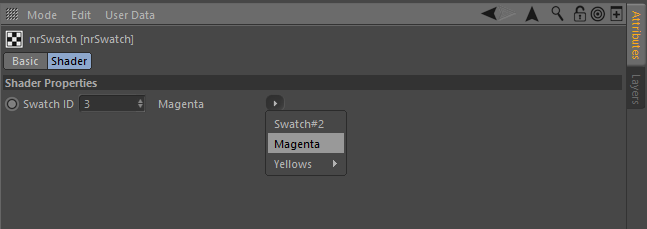
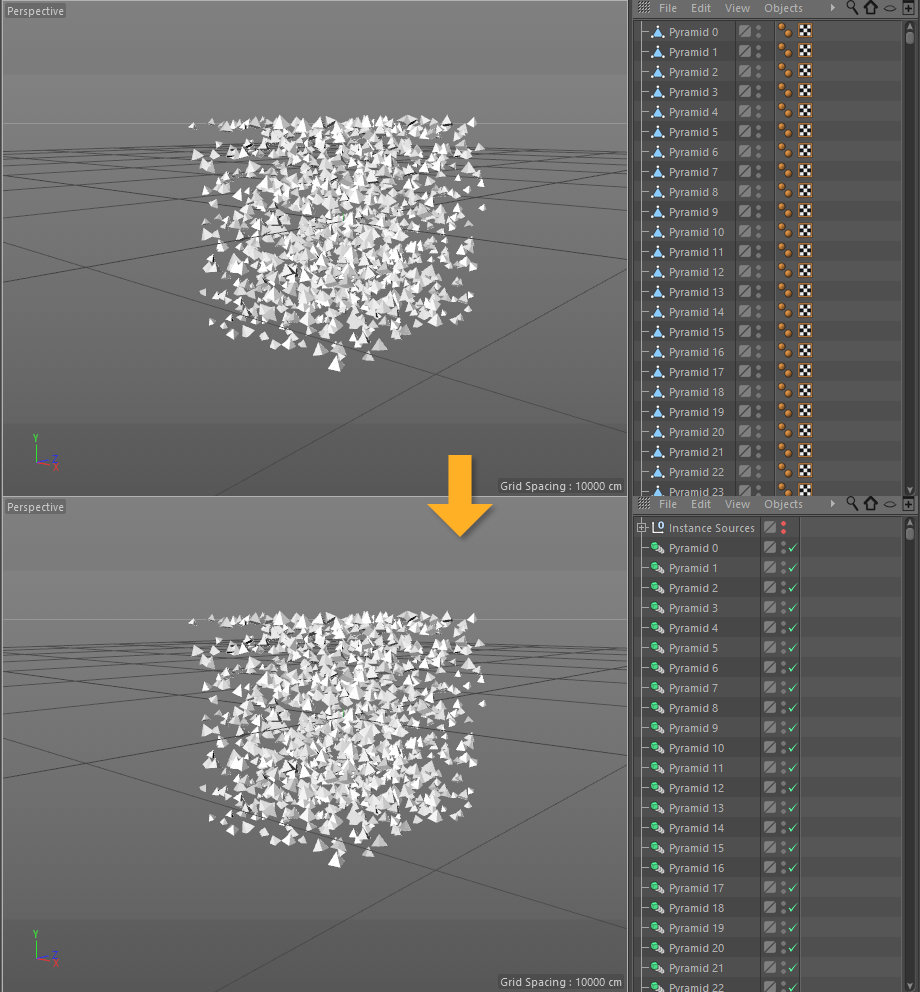
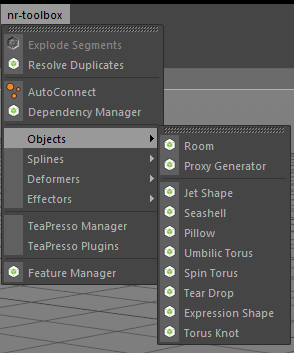
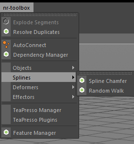
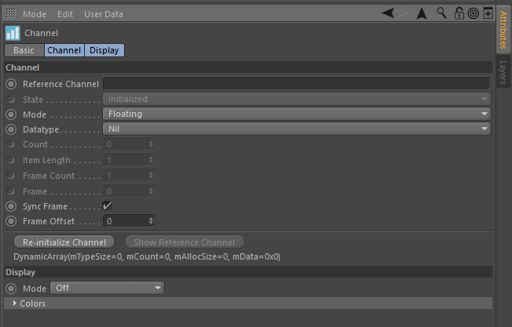

# c4d-nr-toolbox

This is a collection of Cinema 4D C++ plugins, most of which are prototypes
that have not been released before. The collection also includes the
**TimeHide** and **SafeFrame** plugins which I used to sell on my website.

I chose to open source all of it as I'm no longer planning on a commercial
release on any of these.

> __Disclaimer__: Most of this is really, really old code! I've made an effort
> to make it available for R20. If something isn't working or if the plugin
> destroys your PC, car and house, it may be my fault, but you can not hold me
> accountable for it!

__Table of Contents__

* [Download & Installation Instructions](#download--install-instructions)
* [Plugin Contents](#plugin-contents)
* [Build Instructions](#build-instructions)
* [Third party libraries](#third-party-libraries)

# Download & Installation Instructions

Check the [Releases] page for prebuilt binaries. Unzip the appropriate ZIP
archive into your Cinema 4D plugins folder.

[Releases]: https://github.com/NiklasRosenstein/c4d-nr-toolbox/releases
[niklasrosenstein.com]: https://www.niklasrosenstein.com/

# Plugin Contents

* [Feature Manager](#feature-manager)
* [nrWorkflow](#nrworkflow)
    * [TimeHide](#timehide)
    * [SafeFrame](#safeframe)
    * [Swatches](#swatches) 1)
    * [Viewport](#viewport) 1)
* [Commands](#commands)
    * [Explode Segments](#explode-segments) 1)
    * [Resolve Duplicates](#resolve-duplicates) 1)
* [Deformers](#deformers)
    * [SmearDeformer](#smeardeformer) 1)
* [Effectors](#effectors)
    * [XPresso Effector](#xpresso-effector) 1)
    * [CSV Effector](#csv-effector) 1)
* [XPresso Nodes](#xpresso-nodes)
    * [MoData Node](#modata-node) 1)
    * [CSV Node](#csv-node) 1)
* [Savers/Loaders](#savers-loaders)
    * [WebP](#webp) 1)
* [AutoConnect](#autoconnect)
* [Dependency Manager](#dependency-manager) 1)
* [Pr1mitive](#pr1mitive) 1)
* [Procedural](#procedural) 1)
* [TeaPresso](#teapresso) 1)

1) These components never made it out of the prototype phase.

## Feature Manager

The **Feature Manager** allows you to enable and disable features of the
**NR Toolbox** plugin.

## nrWorkflow

### TimeHide

The **TimeHide** feature was previously available as a separate plugin on the
[niklasrosenstein.com] online store and is now integrated into **NR Workflow
Tools**. It provides an enhanced workflow for animators that regularly deal
with large amounts of animated objects, removing the clutter from the Cinema
4D **Timeline** and showing you only what you want to focus on.

> __Original Plugin Description__
>
> Working with the Timeline in Cinema 4D can become uncomfortable very fast.
> Only a few objects and parameters animated can let you loose the overview.
> Cinema 4D’s “Automatic Mode ” and “Link View to Object Manager” commands do
> not help much.
>
> The TimeHide plugin helps you to keep your Timeline in Cinema 4D clean and
> organized. Unnecessary elements are hidden so you only see what’s important.
> he plugin adds a new tab to your document settings. From there, you can
> enable or disable the functionality of the plugin.
>
> *Features*
>
> - Keep focused on what you need to see in the Timeline!
> - Scripts to Toggle parameters On/Off included
> - Free Service Updates
>
> *Languages*
>
> - English
> - German
> - Czech (thanks to Lubomir Bezek)
> - French (thanks to Antoine Aurety)
> - Japanese (thanks to Toshihide Miyata)

#### Parameters

The **Only Show Selected Elements** option will hide all elements from the
Timeline that are not selected in their respective other manager (ie. the
Object Manager, Material Manager, XPresso Manager, etc.).

The **Only Show Animated Elements** option will hide all elements that are
currently displayed in the Timeline, but that do not have any keyframes set
(eg. if you deleted all keys of a track, the object would still be visible).

In the below GIF, you can see an example with the parameter enabled and also
with the *Tracks within the Preview Range* mode set in the **Display Tracks**
parameter.

#### Toggle Commands

*To do*

### SafeFrame

The **SafeFrame** feature was previously available as a separate plugin on the
[niklasrosenstein.com] online store and is now integrated into **NR Workflow
Tools**.

> __Original Plugin Description__
>
> It is a common problem with Cinema 4D when doing renders in the Viewport and
> not the Picture Viewer, that more area of the final image is visible than in
> the production renders. SafeFrame approaches this problem by masking out these
> areas!

#### Example

Usually, the Cinema 4D Viewport Rendering would fill all the available space
in the Viewport.

With **SafeFrame** enabled, the superfluous space will be rendered black.

You can also choose to add a border, change the color and alpha.

> **Disclaimer**
>
> The **SafeFrame** plugin does not make rendering faster.
> Unfortunately, it is not possible to tell Cinema 4D to skip certain parts
> of the image. Also note that this plugin only works with the Standard and
> Physical renderer.

### Swatches

The new **Color Palette** User Data Type that can be added to any object or
tag in Cinema 4D and read from XPresso or Python. The Color Palette behaves
almost exactly like the Cinema 4D color swatches from the Color Picker UI,
only that the User Data Type allows you to have many of these color palettes
attached to various or a single object.

In the Attributes Manager Mode of **NR Toolbox**, you can find the
**Swatches** tab which gives you a document-wide, globally available Color
Palette and the **Synchronize Shaders** checkbox.

#### Synchronize Shaders

When this option is enabled, which it is by default, Cinema 4D **Color Shaders**
of which the name starts with `swatch:` will automatically be adjusted to match
the color of the swatch in the global Color Palette given by the name that
follows the `swatch:` string.

#### Swatch Shader

The **nrSwatch** shader is an alternative to use the **Synchronize Shaders**
feature that allows you to select one of the swatches saved in the *nr-toolbox*
global Color Palette.

### Viewport

The **Viewport Settings** feature is available as a tab in the Attributes
Manager Mode of **NR Toolbox**.

#### Show UVs

When this option is enabled, you will see the UVs of all objects in your scene
rendered directly into the viewport.

## Commands

### Explode Segments

The **Explode Segments** command is basically the Cinema 4D **Polygon Groups
to Objects** command, but many times faster. To use it, select a single Polygon
Object and run the command. The command employs an efficient algorithm that is
easily 20x faster than the native Cinema 4D command and it supports

- UVW
- Vertex Weights
- Vertex Color (R18+)

### Resolve Duplicates

The **Resolve Duplicates** command replaces duplicate Polygon Objects in your
scene with Cinema 4D **Render Instances**.

>  **Disclaimer**:  
> The larger and complex the objects for which the command is run, the more
> imprecise the results can be and in certain situations, seemingly duplicate
> objects can not be detected to be the same. Also keep in mind that the
> command only works on topologically equal objects with the same (relative)
> point coordinates.
> 
> Only Polygon Objects can be replaced with this command.

When you run this command, it will ask you whether you want to enable undoing
the operation. Choose **No** for rather large scenes. The number of actions
that would need to be undone can be quite high and eventually freeze Cinema 4D
for a long time.

**Known Issues**

- Objects with the same topological properties but a shear
  transformation applied might not be resolved correctly.

## Deformers

### SmearDeformer

The SmearDeformer is a deformer object that blends between the animation
history of an object to create jiggle effects.

## Effectors

### XPresso Effector

The **XPresso Effector** allows you to create MoGraph Effectors using XPresso.

### CSV Effector

## XPresso Nodes

### MoData Node

This node is only useful inside the *XPresso Tag* of the *XPresso Effector*.

### CSV Node

This node allows you to read CSV data from a file into XPresso.

## Savers/Loaders

### WebP

Load and save `.webp` image files directly from inside of Cinema 4D.

> Note: Check out the [License Information](LICENSE.txt)

## AutoConnect

Originally available at https://github.com/NiklasRosenstein/c4d-auto-connect

Create MoGraph connectors on an object hierarchy. This project started
May 2013 and is now publicly available with source code. It is almost in
its original state. There is no guarantee that it will be maintained, but
feel free to create a new Issue if you have problems conpiling the plugin
or have an idea for improvements.

#### Usage

Select a **Null-Object** that contains all the objects that you want to connect.
Then open the AutoConnect plugin, change the parameters in the dialog and click
the "Execute" button.

## Dependency Manager

The dependency manager helps you to keep track of your dynamics forces
and effectors.

__Features__

- Supports MoGraph Effectors as well as Dynamics forces
- Drag&Drop effectors to insert them into the cloner or change their execution order

## Pr1mitive

 

*Pr1mitive* was originally planned as a commercial release. It is a collection
of new generator objects, mostly composed of mathematical shapes.

* Room: A 4-wall room generator.
* Proxy Generator
* ...
* Spline Chamfer
* Random Walk
* Axis Align Tag

## Procedural

This was a prototype to imitate Houdini's ability to attach arbitrary data to
the points, vertices and polygons. The "Channel" tag allows you to create a
named channel on an object that can contain a number of elements of a datatype.

The "CSV Reader" tag allows you to read a CSV file into a "Channel" tag.

The [`nr.procedural`](python/nr/procedural.py) Python module provides a
Python API to access the channels of an object and its data.

 

## TeaPresso

# Build Instructions

You need the [Craftr 4][Craftr] build system. Clone the repository
recursively and build.

[Craftr]: https://github.com/craftr-build/craftr

    cd /path/to/Cinema4D/plugins
    git clone https://github.com/NiklasRosenstein/c4d-nr-toolbox.git
    cd c4d-nr-toolbox
    craftr -cb --variant=release

---

# Third party libraries

* libwebp
* dlib

Check the [LICENSE.txt](LICENSE.txt) for license information.

---

Copyright &copy; 2018 Niklas Rosenstein

