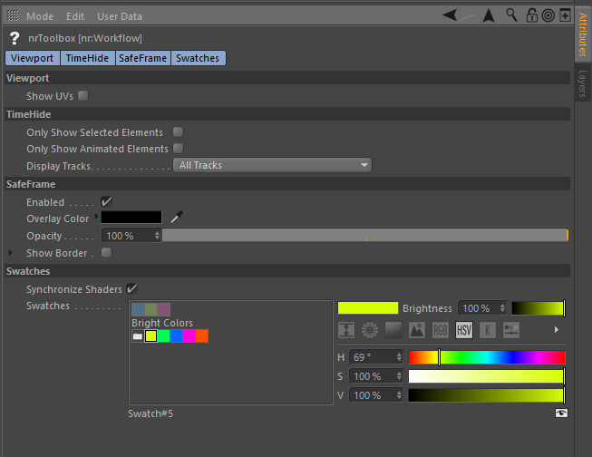
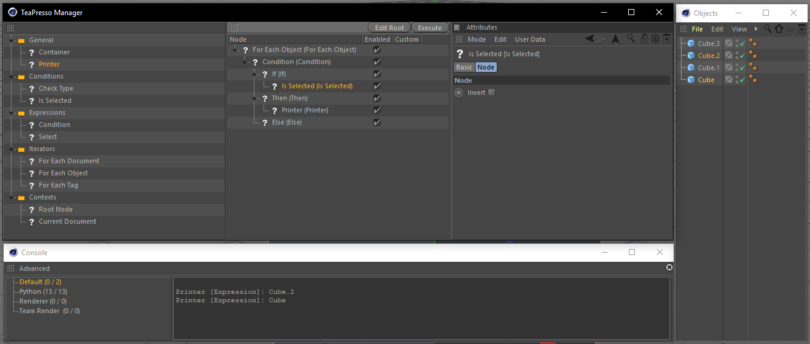

# c4d-nr-toolbox

This is a collection of Cinema 4D C++ plugins, most of which are prototypes
that have not been released before. The collection also includes the
**TimeHide** and **SafeFrame** plugins which I used to sell on my website.

I chose to open source all of it as I'm no longer planning on a commercial
release on any of these.

> __Disclaimer__: Most of this is really, really old code! I've made an effort
> to make it available for R20. If something isn't working or if the plugin
> destroys your PC, car and house, it may be my fault, but you can not hold me
> accountable for it!

__Table of Contents__

* [Download & Installation Instructions](#download--install-instructions)
* [Plugin Contents](#plugin-contents)
* [Build Instructions](#build-instructions)
* [Third party libraries](#third-party-libraries)

---

## Download & Installation Instructions

Check the [Releases] page for prebuilt binaries. Unzip the appropriate ZIP
archive into your Cinema 4D plugins folder.

[Releases]: https://github.com/NiklasRosenstein/c4d-nr-toolbox/releases

---

## Plugin Contents

* [Feature Manager](#feature-manager)
* [nrWorkflow](#nrworkflow)
    * [TimeHide](#timehide)
    * [SafeFrame](#safeframe)
    * [Swatches](#swatches)
    * [Viewport](#viewport)
* [Commands](#commands)
    * [Explode](#explode)
    * [Resolve Duplicates](#resolve-duplicates)
* [Deformers](#deformers)
    * [SmearDeformer](#smeardeformer)
* [Effectors](#effectors)
    * [XPresso Effector](#xpresso-effector)
    * [CSV Effector](#csv-effector)
* [XPresso Nodes](#xpresso-nodes)
    * [MoData Node](#modata-node)
    * [CSV Node](#csv-node)
* [Savers/Loaders](#savers-loaders)
    * [WebP](#webp)
* [AutoConnect](#autoconnect)
* [Dependency Manager](#dependency-manager)
* [Pr1mitive](#pr1mitive)
* [Procedural](#procedural)
* [TeaPresso](#teapresso)

### Feature Manager

### nrWorkflow

#### TimeHide

#### SafeFrame

#### Swatches

#### Viewport

### Commands

#### Explode

#### Resolve Duplicates

### Deformers

#### SmearDeformer

### Effectors

#### XPresso Effector

#### CSV Effector

### XPresso Nodes

#### MoData Node

#### CSV Node

### Savers/Loaders

#### WebP

### AutoConnect

Originally available at https://github.com/NiklasRosenstein/c4d-auto-connect

Create MoGraph connectors on an object hierarchy. This project started
May 2013 and is now publicly available with source code. It is almost in
its original state. There is no guarantee that it will be maintained, but
feel free to create a new Issue if you have problems conpiling the plugin
or have an idea for improvements.

### Dependency Manager

### Pr1mitive

### Procedural

### TeaPresso

---

## Build Instructions

You need the [Craftr 4][Craftr] build system. Clone the repository
recursively and build.

[Craftr]: https://github.com/craftr-build/craftr

    cd /path/to/Cinema4D/plugins
    git clone https://github.com/NiklasRosenstein/c4d-nr-toolbox.git
    cd c4d-nr-toolbox
    craftr -cb --variant=release

## Third party libraries

* libwebp
* dlib

Check the [LICENSE.txt](LICENSE.txt) for license information.

---

Copyright &copy; 2018 Niklas Rosenstein

