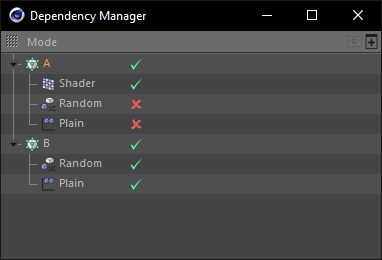

# Dependency Manager

The dependency manager helps you to keep track of your dynamics forces
and effectors.

__Features__

- Supports MoGraph Effectors as well as Dynamics forces
- Drag&Drop effectors to insert them into the cloner or change their execution order
