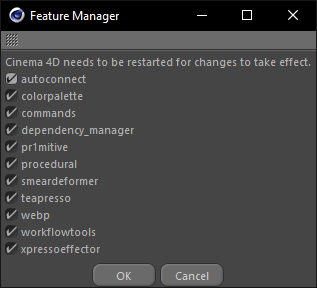

# Feature Manager

The **Feature Manager** allows you to enable and disable certain components
of the nr-toolbox. When a feature is disabled, the plugins of that feature
will not be registered on the next startup.
