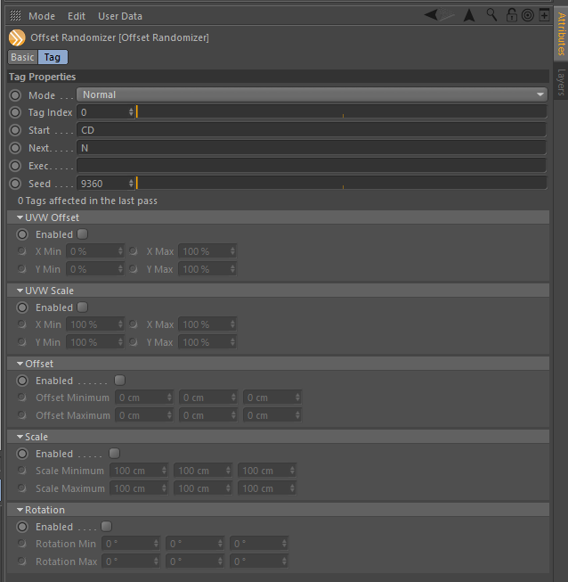

# OffsetRandomizer

[back in 2010]: https://www.psd-tutorials.de/forum/threads/offset-randomizer-plug-in.120696/

This plugin started as a COFFEE plugin [back in 2010], allowing you to
randomize the UV position and scale of texture tags.

With this tag you can do the same but without needing to convert your
object hierarchy, meaning you can apply it to a Cloner object to modify
the texture tags of its clones.

With Cinema 4D R17, the Variation Shader was introduced so this plugin will
have very limited applications beyond what the shader can already do for you.

#### Known Issues

* Doesn't function properly for nested cloners
