# Pr1mitive

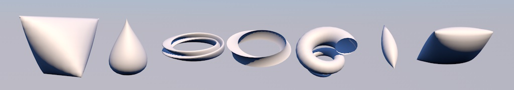

*Pr1mitive* was originally planned as a commercial release. It is a collection
of new generator objects, most of which are mathematical shapes based on the
formulas at http://www.3d-meier.de/.

__Table of Contents__

* __Shapes:__
* [Expression Shape](#expression-shape)
* [Tear Drop](#tear-drop)
* [Spin Torus](#spin-torus)
* [Umbilic Torus](#umbilic-torus)
* [Seashell](#seashell)
* [Jet Shape](#jet-shape)
* [Pillow](#pillow)
* __Splines:__
* [Torus Knot](#torus-knot)
* [Spline Chamfer](#spline-chamfer)
* [Random Walk](#random-walk)
* __Tags__:
* [Axis Align Tag](#axis-align-tag)

## Expression Shape

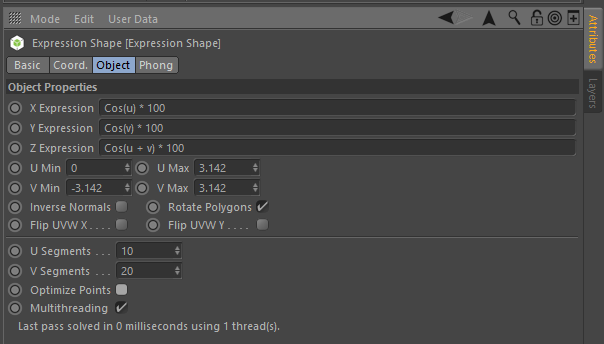

This generator allows you to specify your own formulas for warping an 2D
plane based on UV coordinates. The default values implement the
"Cosine Surface" from http://www.3d-meier.de/tut3/Seite39.html.

## Tear Drop

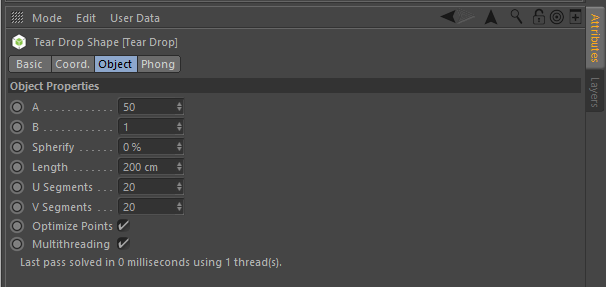

http://www.3d-meier.de/tut3/Seite44.html

## Spin Torus

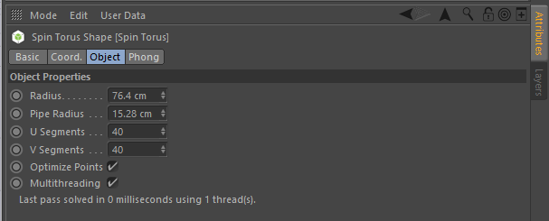

http://www.3d-meier.de/tut3/Seite60.html

## Umbilic Torus

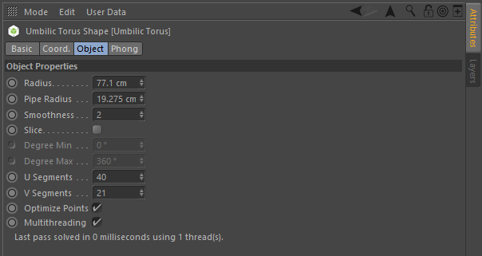

http://www.3d-meier.de/tut3/Seite61.html

## Seashell

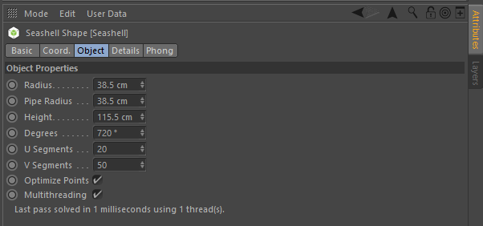

http://www.3d-meier.de/tut3/Seite18.html

## Jet Shape

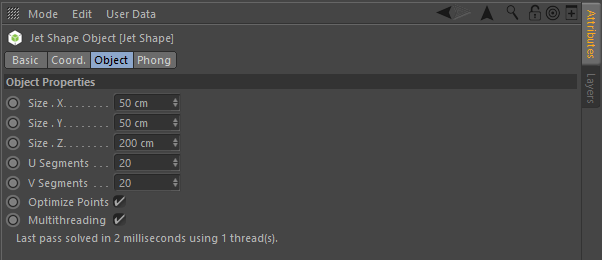

http://www.3d-meier.de/tut3/Seite43.html

## Pillow

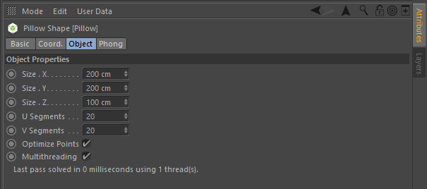

http://www.3d-meier.de/tut3/Seite46.html

## Torus Knot

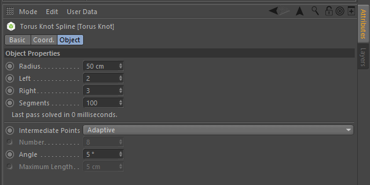

http://www.3d-meier.de/tut8/Seite27.html

## Spline Chamfer

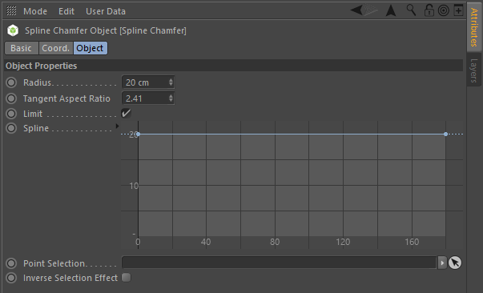

This generator object takes a single input spline and allows you to round
its points.

Example on an N-Gon Spline:

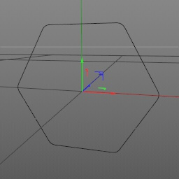

## Random Walk

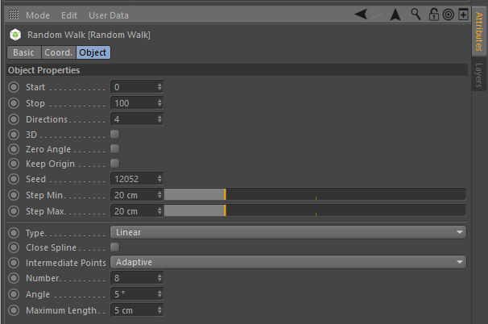

Example:

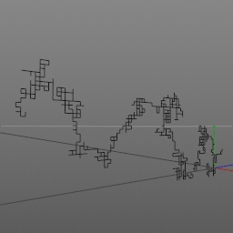

## Axis Align Tag

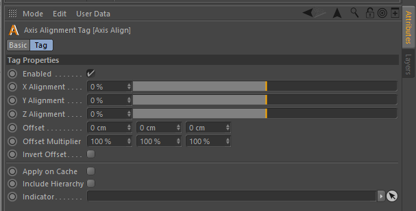
