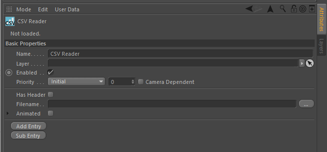

# Procedural

This was a prototype to imitate Houdini's ability to attach arbitrary data to
the points, vertices and polygons. The "Channel" tag allows you to create a
named channel on an object that can contain a number of elements of a datatype.

The "CSV Reader" tag allows you to read a CSV file into a "Channel" tag.

The [`nr.procedural`](../python/nr/procedural.py) Python module provides a
Python API to access the channels of an object and its data.

