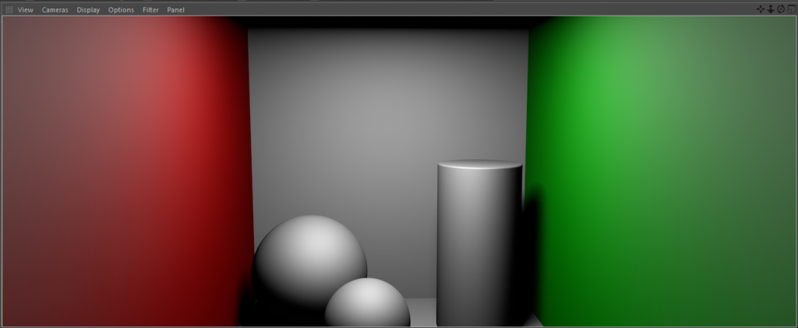

# SafeFrame

The **SafeFrame** feature was previously available as a separate plugin on the
[niklasrosenstein.com] online store and is now integrated into **NR Workflow
Tools**.

> __Original Plugin Description__
>
> It is a common problem with Cinema 4D when doing renders in the Viewport and
> not the Picture Viewer, that more area of the final image is visible than in
> the production renders. SafeFrame approaches this problem by masking out these
> areas!

#### Example

Usually, the Cinema 4D Viewport Rendering would fill all the available space
in the Viewport.

With **SafeFrame** enabled, the superfluous space will be rendered black.

You can also choose to add a border, change the color and alpha.

> **Disclaimer**
>
> The **SafeFrame** plugin does not make rendering faster.
> Unfortunately, it is not possible to tell Cinema 4D to skip certain parts
> of the image. Also note that this plugin only works with the Standard and
> Physical renderer.
